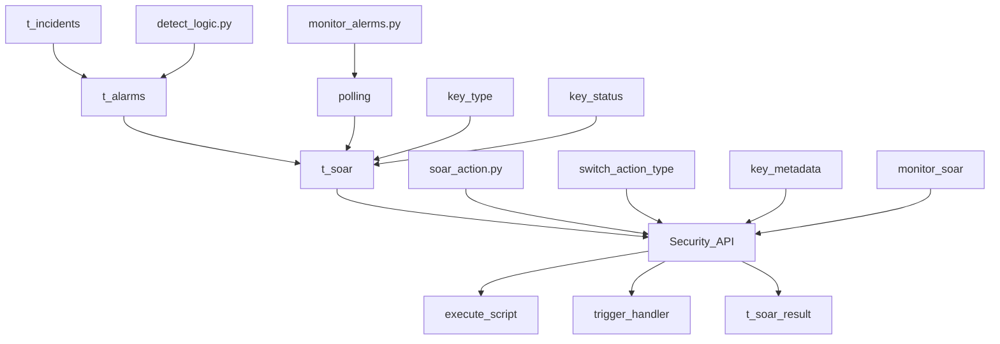

## Type
- automatic alarm handling

## Practice
- WAF：IP Block
- RASP ：block RCE / file access / oubound domain
- HIPS ：account delete/ webshell delete / iptables block / process kill / DNS / 
- Honeypot : DNS / WAF

## Process

