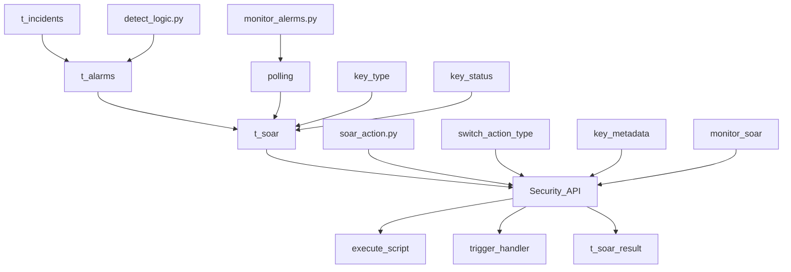

## Type
- automatic alarm handling

## Practice
- WAF：IP Block
- RASP ：block RCE / file access / oubound domain
- HIPS ：account delete/ webshell delete / iptables block / process kill / DNS / 
- Honeypot : DNS / WAF

## Difficulty
- Fields Normalized

## Process

## database
- t_alarms

| type  | accident-id | title | SIP | DIP |
| ------- | ----- | ----- | ----- |  ----- |
| WAF  | accident-123  | Log4j injection | 9.9.9.9 | 10.1.1.3 |
| HIDS | accident-124  | Reverse shell | 7.7.7.7 | 10.1.1.4 |

- t_soar

| type  | job-id | title | SIP | DIP | action | 
| ------- | ----- | ----- | ----- |  ----- |  ----- |
| WAF  | job-123  | Log4j injection | 9.9.9.9 | 10.1.1.3 | block-ip |
| HIDS | job-124  | Reverse shell | 7.7.7.7 | 10.1.1.4 | kill-pid |

- Security_API
  - Router: type, action, metadata:{sip, dip}
    - POST /waf/block  {sip:"SIP"}
    - POST /hids/v1/api  {command: kill -9 \"pid\"}
